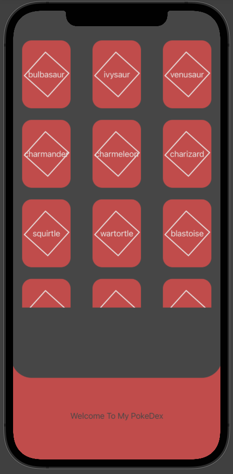
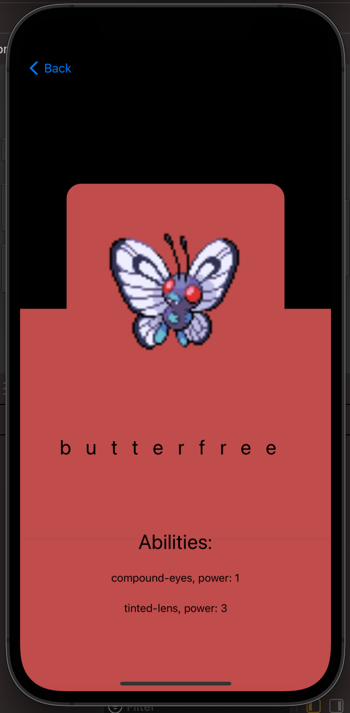

# PokeDex - APP

This project its connected to the pokeapi

## Table of contents

- [Overview](#overview) 
  - [Screenshot](#screenshot)
  - [Links](#links)
- [My process](#my-process)
  - [Built with](#built-with) 
  - [Continued development](#continued-development) 
- [Author](#author) 
 
## Overview
 
### Screenshot

   

   

 
### Links

- Api URL: [PokeApi](https://pokeapi.co) 

## My process

### Built with

- Swift
- SwiftUI

### Continued development

i want to keep getting better at interface design and made an app with persistance storage

## Author

- Website - [karen cofre](https://www.karencofre.tech) 
 
